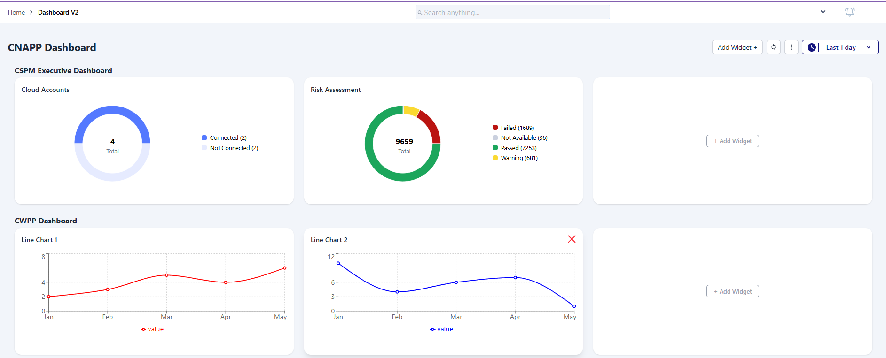
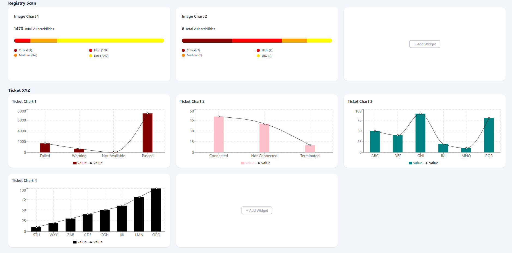
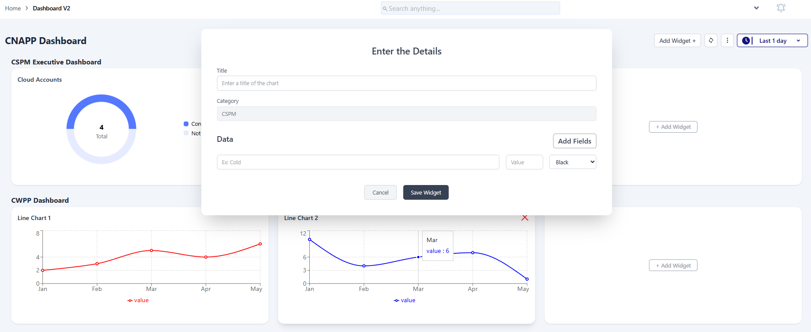

# 📊 Dashboard Widgets Application

This project is a **Dashboard Page** built using **React.js**.
It allows users to dynamically manage widgets across multiple categories, with support for **charts, search, add/remove, and toggle visibility**.

---

## 📸 Screenshots

### Dashboard

### Add Widget

### Change Visibility of Widget

### Search Widgets

## 🚀 Features

- 📂 **Dynamic JSON-driven Dashboard**
  - Categories like **CSPM, CWPP, Registry Scan, Ticket**, each containing multiple widgets.
- ➕ **Add Widgets Dynamically**
  - Enter widget title, fields, and chart details.
- ❌ **Remove Widgets Easily**
  - Remove via the close (X) icon or hide/uncheck from category management.
- 🔍 **Search Widgets**
  - Search by widget **title** across all categories.
- 📈 **Charts & Graphs**
  - Built with [**Recharts**](https://recharts.org/) for Pie, Line, and Bar charts.
- 🎨 **Styling**
  - [**Tailwind CSS**](https://tailwindcss.com/) for modern, responsive design.
- 🖼️ **Icons**
  - [**React Icons**](https://react-icons.github.io/react-icons/) for intuitive UI actions.
- 🗄️ **Local State Management**
  - Managed using React Context + Reducer (no backend required).

---

## 🛠️ Tech Stack

- **React.js** – Core framework
- **Tailwind CSS** – Styling
- **Recharts** – Graphs and Charts
- **React Icons** – Icons

---

## 📂 Folder Structure

src/
│── components/ # Reusable components (SearchBar, Menu, NotificationBox, etc.)
│── widgets/ # Dashboard widgets (CSPM, CWPP, RegistryScan, Tickets)
│── Data-Context/ # Context API + Reducer for state management
│── App.jsx # Root component
│── main.jsx # Entry point

## 📂 Project Setup & Installation

### 1️⃣ Clone the repository

git clone <project-repo-link>
cd <project-folder-name>

### 2️⃣ Install dependencies

npm install

### 3️⃣ Start the development server

npm start
